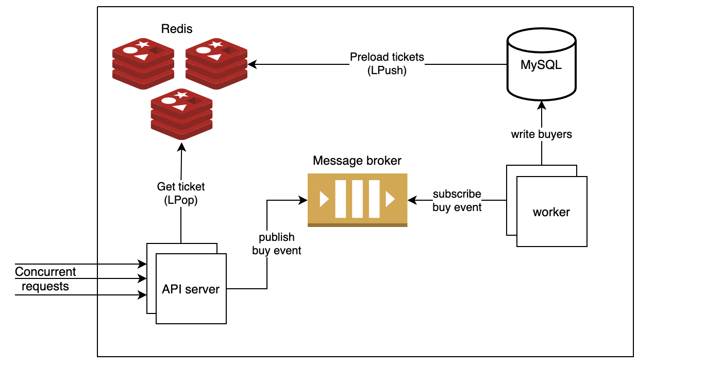

# Redis Ticket Booking
Simple demonstration of a high concurrency ticket booking system.

Imagine hundreds of thousands of users are booking tickets at the same time. Such concurrency would definitely overwhelm our database since MySQL could only handle about 1000 writes per second. In addition, we should avoid race conditions when multiple users book the same ticket simultaneously.

This demonstration provides a way of designing a scalable architecture while maintaining its correctness under highly concurrent requests.
## Architecture

### In-Memory Cache
We rely on Redis for handling highly concurrent requests since Redis is able to handle up to 100K concurrent requests per second. What we do here is to preload tickets from MySQL to Redis in advance and implement ticket booking logic directly in a Redis list. This way, we could avoid the I/O bottleneck of MySQL. Besides, the atomicity of Redis `LPop` command ensures the booking correctness so that race conditions such as selling a sold ticket to another user will never happen.
### Asynchronous Processing and Eventual Consistency
To increase throughputs, we process sold tickets asynchronously using event-based communication. The API server publish buy events to message broker to inform workers of new buyers. Once a worker receives a buy event, it persists the corresponding ticket buyer to MySQL, reaching eventual consistency.
## Getting Started
```bash
docker-compose up
```
This will start an API server, a MySQL database, and a Redis instance. For simplicity, the backend server runs a separate goroutine that subscribes to buy events and writes corresponding buyers to MySQL asynchronously. Note that each user can buy at most one ticket. If an user buys more than one ticket, the server will return `429 Too Many Requests`.
## Testing
We use [wrk](https://github.com/wg/wrk) to benchmark the performance as well as the correctness under concurrent requests. The following command tells `wrk` to book tickets with 100 threads and 100 open connections. `test.lua` is called per request in order to simulate an unique user.
```bash
wrk -t100 -c100 -d1s --latency -s ./test.lua http://localhost:8080
```